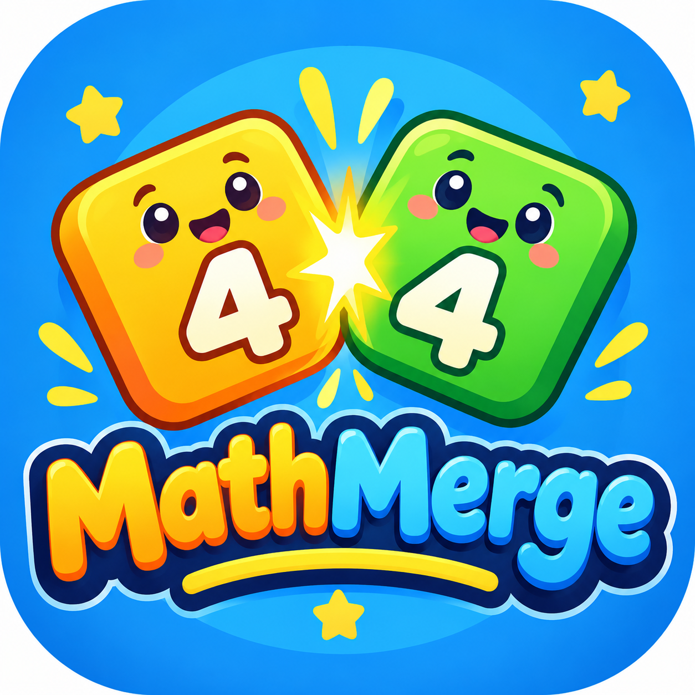

# MathMerge (Number Fusion)

Number Fusion (MathMerge) is an educational math puzzle game inspired by 2048. It combines addictive tile-merging mechanics with math challenges, helping players improve their calculation skills while having fun.

## 🚀 Features

*   **Educational Gameplay**: Solve equations and merge numbers to progress and reach the target number.
*   **Multiple Modes**:
    *   **Level Mode**: Progress through increasingly difficult levels.
    *   **Practice Mode**: Hone your skills without the pressure.
*   **Adaptive Challenges**: The game adjusts to your skill level.
*   **Prediction & Challenge Modes**: Customize the frequency of math challenges and use prediction mode to anticipate your moves.
*   **Number Journey**: Track your progress, solved equations, and unlocked numbers.
*   **Interactive UI**: Smooth animations, sound effects, and a beautiful gradient-based design.

## 📸 Overview

## 🎮 How to Play

Use your arrow keys (or swipe on touch devices) to move the tiles. When tiles merge, you might encounter math equations and challenges! Reach the target number for each level to win, unlock your Number Journey, and improve your math skills along the way.
